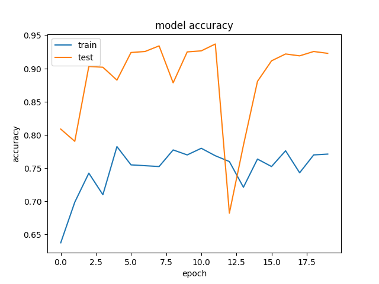
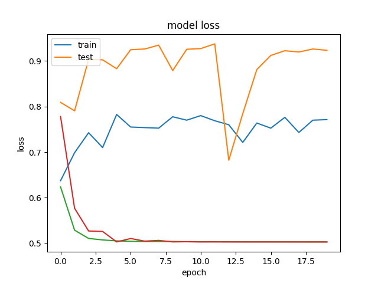

Cat or Dog
==========

Model based on InceptionV3 pre-trained on ImageNet, with last few layers refined on cat/dog images.

Installation
============
```bash
pip install -r requirements.txt
```

Data
====
```bash
cd data
./download.sh
```

Train
=====
```bash
python train.py
```

Accuracy/Loss
=============

These images will be saved in `./out/`





Classify some images
====================

```bash
python classify_images.py data/test_images/*
```


```
Prediction for data/test_images/catordog.jpg:
Class cats: 99.6%
Class dogs: 0.4%
```


```
Prediction for data/test_images/catordog2.jpg:
Class cats: 0.4%
Class dogs: 99.6%
```


```
Prediction for data/test_images/eski.jpg:
Class cats: 0.0%
Class dogs: 100.0%
```

Rotation prediction
===================

In this experiment we attempt to predict the rotation of the image. The idea is that in order to be able to predict rotation, the network must be learning features that are useful for classification as well. We will train a network to predict the degrees of rotation (0, 90, 180, 270). By using these 90 degree rotations we avoid the complications of cropping the image correctly without introducing artifacts. 

After training such a network, we will attempt to re-use it for classification by training a few additional layers on top of it on the classification task. We hope to see an improvment in classification accuracy, or at least fast training, which will show that the rotation task is learning something about what is inside the image.