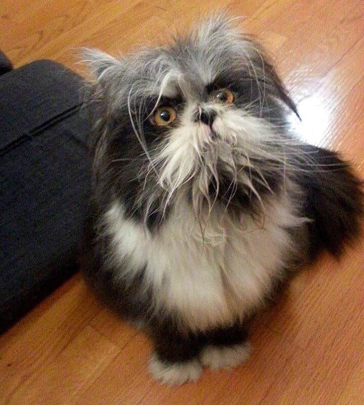
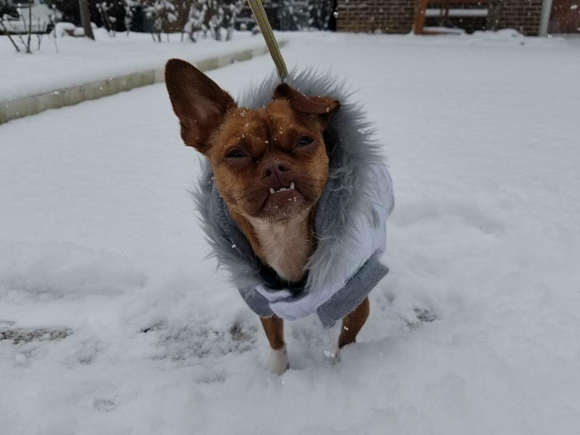
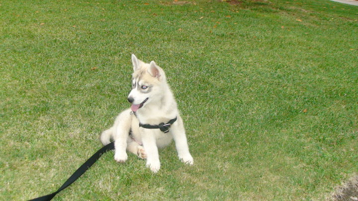

Cat or Dog
==========

Model base on InceptionV3

Installation
============
```bash
pip install -r requirements.txt
```

Data
====
```bash
cd data
./download.sh
```

Train
=====
```bash
python train.py
```

Classify some images
====================

```bash
python classify_images.py data/test_images/*
```



```
Prediction for data/test_images/catordog.jpg:
Class cats: 99.6%
Class dogs: 0.4%
```



```
Prediction for data/test_images/catordog2.jpg:
Class cats: 0.4%
Class dogs: 99.6%
```



```
Prediction for data/test_images/eski.jpg:
Class cats: 0.0%
Class dogs: 100.0%
```